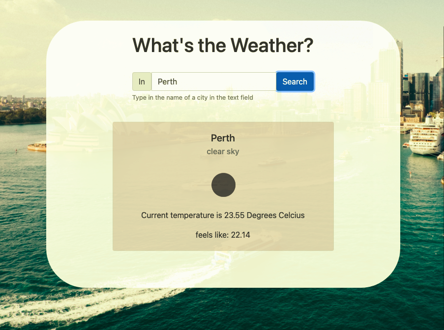

# weather-app

A simple weather app that displays the weather for the city that you type in. 
Practice for HTML5, CSS, API, Bootstrap, Async Javascript. 

The project's creator and instructions for this project can be found on https://github.com/aar9nk/genxi-jwd-weather-app

